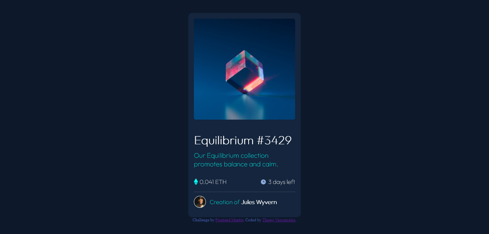
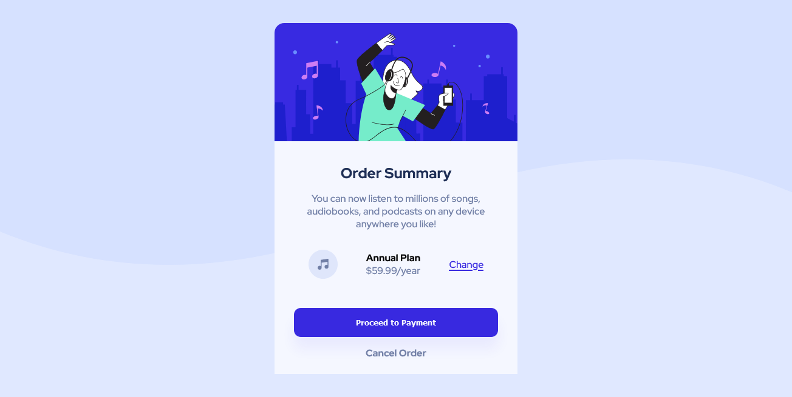

# Frontend Mentor - Challenges

## Welcome! 👋

Thanks for checking all my frontend challenges

[Frontend Mentor](https://www.frontendmentor.io) challenges help you improve your coding skills by building realistic projects.

- [First Challenge](Challenge01-NftPreviewCard/)
    - Live Site URL: [Github Pages](https://thiagovasc.github.io/Nft-Preview-Card/)
    - Solution URL: [Solution submitted on frontend mentor](https://www.frontendmentor.io/solutions/responsive-nft-preview-card-hwXVReWLj)

- [Second Challenge](Challenge02-OrderSumary/)
    - Live Site URL: [Github Pages](https://thiagovasc.github.io/Order-Summary/)
    - Solution URL: [Solution submitted on frontend mentor](https://www.frontendmentor.io/solutions/responsive-landing-page-using-flexbox-oXT-T_NF5)

- [Third Challenge](https://www.frontendmentor.io/challenges/stats-preview-card-component-8JqbgoU62)
    - Live Site URL: [Netlify Pages](https://challenge03-thiagovasc.netlify.app/)
    - Solution URL [Solution submitted on frontend mentor](https://www.frontendmentor.io/solutions/responsive-stats-preview-card-component-using-flexbox-grid-ByQwGvfX5)
  

